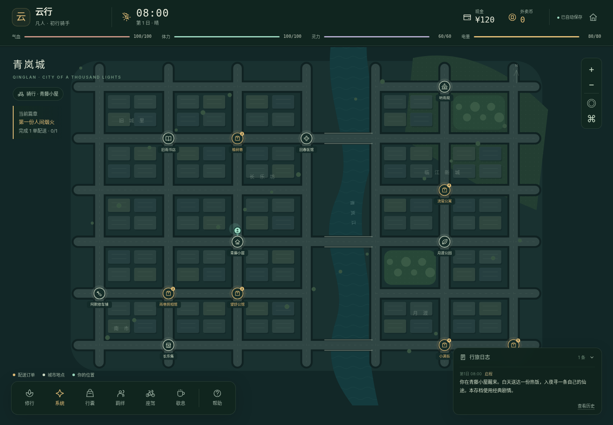

# 外卖修仙录 · 项目重建版

**白天送达一份热饭，入夜寻一条自己的仙途。**

这是根据项目对话记录重新实现的单机 Web RPG，版本 **1.1.0**，重建日期 **2026-09-18**。原账号读取返回 `403: Sorry. Your account was suspended`，没有取得旧仓库源码。因此，这是**玩法与需求重建**，不是原始代码、界面和剧情文本的逐字恢复。

已交付完整源代码、可直接打开的单文件版本、本机 AI 代理、自动化测试与恢复说明。无需 GitHub 登录即可运行，不依赖原仓库或在线地图服务。



## 开始游玩

### 方式一：直接打开离线版

用浏览器打开 `dist/index.html`，点击“开启新旅程”，输入名字并选择**经典剧情**。界面、地图、规则和经典剧情都在这一个文件里；不需要安装依赖。

**长期存档建议使用下面的本机服务。** 浏览器直接打开 `file:` 文件时，localStorage 的行为没有统一保证，不同浏览器可能不同。程序会在保存失败时提示，并保留当前页面中的可导出进度。关闭页面前请导出 JSON 存档。[1]

### 方式二：本机服务（推荐）

准备 **Node.js 22.16.0 或以上版本**。在项目根目录运行：

```sh
npm start
```

然后在浏览器打开：

```text
http://127.0.0.1:8787
```

Windows 也可双击根目录的 `开始游戏.bat`。本项目没有 npm 运行时依赖，**不需要先执行 `npm install`**。关闭终端或按 `Ctrl+C` 会停止本机服务；游戏存档仍位于浏览器中。

请固定使用同一浏览器、同一个地址和端口游玩。不同来源的浏览器存储彼此隔离；更换入口前先导出，随后再导入。[1]

## 已实现的玩法

| 模块 | 当前实现 |
| --- | --- |
| 地图配送 | 青岚城 42 个地点，包含 9 个常驻服务/住宅地点与 33 个潜在配送目的地；常驻地点也可能收到订单。普通配送点仅在有任务时显示。 |
| 合并配送流程 | 点击地图任务点查看要求、距离、预计耗时、电量与体力，确认后直接配送，不另设取餐流程。 |
| 位置与时间 | 游戏连续运行，人物沿道路和桥梁逐步移动，途中可停止或改道；路程、耗时与电量/体力/耐久同步。 |
| 动态世界 | 每 15 游戏分钟及世界行动完成后补充订单空缺，已接单不被刷新删除；有昼夜、天气、每日委托与每周房租。玩家可在三处住处间搬家，租金与睡眠恢复不同；房租到期现金不足会结束本局。运行时即使不操作也会计时；全局暂停和页面后台不计时，无离线补算。 |
| 多选项事件 | 31 个基础随机事件模板之外，新增人物相逢与 5 个固定关键主线节点；配送、探索、修炼仍以三选一为主，关键主线不会被 AI 覆盖。 |
| 系统兑换 | 万家灯火系统；配送获得外卖币，基础补给开局可用，破境资源/心法从炼气开放，高阶法器从筑基开放；兑换、签到、领奖均不耗游戏时间。 |
| 修仙 | 六个境界，吐纳、静修、淬体、突破、炼丹、心法和法器；成长线从凡人奔忙推进到城市暗面、护城阵、系统真相与最终选择，修炼进度与主线阈值互相咬合。 |
| 电动车 | 保留电量、车况、充电、维修；充电可在任意地点直接进行，维修与升级仍在修车铺；速度、电池容量、耐用性可分别升级。空电或电量不足时不能骑行，可以改步行。 |
| 人物关系 | 6 位原创 NPC、共 24 个分支章节；NPC 仅在配送或随机奇遇中结识后出现在羁绊页；好感、信任、友情与可选情感路线，不强制进入恋爱。 |
| 结局 | 守城、飞升、烟火生活、情感与友情共 5 类结局；达成后可以继续游玩。 |
| 存档 | 自定义姓名，最多 12 份独立存档，约每 10 秒及关键节点自动保存，途中状态恢复时默认暂停，JSON 导入/导出，上一写入版本备份，损坏检测。 |
| 双剧情模式 | 开局选择经典或 AI，局内不可切换；AI 失效时继续使用经典事件，存档模式不变。 |
| 界面 | 游戏内顶部显示玩家名，中央地图、左下导航、右下唯一日志区域；帮助收纳玩法说明。支持拖拽、滚轮和双指缩放。 |

数值、城市布局、界面美术、人物姓名及具体故事是本次重建新增内容，不代表已找回旧版原文。完整对应关系见 `docs/RECOVERY_NOTES.md`。

## 第一段旅程

创建经典存档后，从青藤小屋出发。选择地图上的金色订单标记，检查消耗后“接单并配送”。第一单会触发系统绑定事件；**做出事件选择后才结算配送奖励**，不要在事件完成前把报酬当作已到账。

现金用来支付房租、充电、修车与升级；外卖币直接在左下角“系统”兑换物品。住处可在“歇息”中更换：低租住处恢复较少，高租住处恢复更完整。每 7 天必须支付当前住处完整房租，现金不足则本局结束。体力不足可在“歇息”原地恢复，也可回小屋睡觉。没有电时，在“座驾”切换步行；不要强行接下无法完成的行程。

晚上进入“修行”收益更高。原地修炼无需赶路，前往听雨观则有额外灵地收益。拜访人物会先计算去其所在地的距离，再加交谈本身的时间。准备好后，在系统委托页领取阶段奖励，在“归途”查看结局条件。

主线不会在开局一次性倾倒设定：完成若干配送、进入更高境界、结识人物后，会依次触发“街脉显形 → 城市背面 → 灯火阵点 → 系统质疑 → 系统真相”。高阶系统兑换也随境界解锁，让成长和剧情同步展开。

地图支持单指/鼠标拖动、滚轮或双指缩放；`+`、`−` 缩放，定位按钮回到玩家，全图按钮查看整座城市。地图标记可用键盘聚焦后按 Enter，方向键可以平移地图。

## 连续时间与操作

新游戏默认开始运行；读取存档默认暂停，点击顶部“继续”后恢复。正常现实 1 秒 = 游戏 1 分钟，时间旁可切换 1 / 3 / 10 倍。运行时不操作也会计时，订单可能过期、房租会到期。

点击地图地点或订单查看路线，再确认出发。人物沿道路移动，消耗随实际路程扣除。地图底部行动栏显示剩余路程、预计时长与进度。“停止”只停下当前行动，世界和订单时限继续；顶部“暂停”才冻结整个游戏。暂停时仍可查看地图、面板、安排行动和进行零耗时系统兑换。

面板和剧情自动暂停，关闭后恢复打开前的状态；不会解除手动暂停。切后台或关闭页面不补算离线时间，返回后需手动继续。睡眠、充电、休息、修炼按进度恢复/增长；炼丹和突破开始时扣投入，中断不退，突破正常失败会退回约 75% 修为。耗时剧情选择提交后不可取消。

搬家到达后住处才生效。第 7、14、21… 日零点房租优先于同刻交付和入住结算；现金不足立即结束，不能用尚未送达的报酬垫付。

## 存档、备份与迁移

自动存档保存的是**游戏状态**，不是源码备份。请同时保存本项目 ZIP 与导出的存档 JSON。

开始页可以导出全部存档、导入存档，或导出/删除单份存档；游戏中点击顶部玩家信息可以导出当前存档。导入总是建立新副本，不覆盖同名、同 ID 的既有记录。删除和恢复自动备份需要确认。

当前格式是 `schemaVersion: 5`。迁移逻辑支持能够识别的重建版 v1–v5 字段；新存储键不存在时自动迁移 v4/v3 本机存档，保留已有住处、车辆、人物关系和事件。进行中行动保留小数时间与道路坐标，不重复扣费或发奖。**没有验证过原仓库旧存档格式**，不能保证旧存档可直接导入。不要为了通过校验，简单修改未知旧存档的版本号。

本地存储禁止写入或空间不足时，界面会提示“未保存”；页面内仍可继续并导出。自动备份只保留前一份写入状态，不是永久历史。多人共享设备、清理站点数据或更换浏览器前请先导出。

## AI 剧情（可选）

经典剧情不需要任何密钥。AI 模式需要**本机 Node 服务**以及你自行配置的兼容 Chat Completions JSON 接口；本次未连接真实模型服务，测试使用模拟上游响应。

将 `.env.example` 复制为 `.env`，填写：

```dotenv
HOST=127.0.0.1
PORT=8787
AI_API_URL=https://your-provider.example/v1/chat/completions
AI_API_KEY=replace-with-your-own-key
AI_MODEL=replace-with-your-model-name
AI_ALLOW_LOCAL_HTTP=false
```

上面 `.example` 地址只是格式示例，不能直接调用。`AI_API_URL` 必须是**完整接口地址**，不是只有主机名；它需要接受 `messages`、`response_format: {"type":"json_object"}` 和 `max_tokens`，并在 `choices[0].message.content` 返回 JSON 文本。不同提供方/模型的参数兼容性可能不同，接入后需要实测。

修改后重新启动 `npm start`。在开始页创建 AI 模式的新存档；已有 AI 存档重新打开页面后也会读取新的服务状态。已创建的经典存档不会改成 AI 存档。

AI 生成用于随机配送/探索/修炼事件及人物日常交谈；系统初次绑定、人物关键章节和主线节点保留经典内容。每次请求只发送角色名、部分游戏状态、所在地点、当前事件素材和最近三条日志文本。它可能产生提供方的接口费用，未配置时不会代为开通任何服务。

密钥仅由本机服务端读取，不写进前端、存档或构建产物；`.env` 已加入忽略规则。不要把密钥放进浏览器代码或提交到仓库。[2]

只接受白名单 JSON 效果并限制数值。AI 不能执行代码、切换模式、直接设置境界/地点，不能绕过主线要求。接口超时、报错、返回非法内容时，仍有经典三选项可选；等待期间也能直接选经典选项。迟到的 AI 回包不会覆盖已经结算的事件。

默认仅监听本机地址。当前服务**不是生产级多人后端**，没有账户体系、身份认证或云存档；不要把带真实密钥的接口直接暴露到公网。

## 项目结构

```text
public/index.html         页面骨架与启动页
public/styles.css        响应式界面、地图及面板样式
public/js/data.js         世界、道具、事件、人物、章节、结局
public/js/engine.js       规则、距离、行动、结算与 AI 校验
public/js/clock.js        连续时钟、独立暂停原因与倍率
public/js/storage.js      自动存档、清洗、导入导出、版本处理
public/js/progression.js  都市修仙成长阶段、系统解锁、关键主线与相逢扩展
public/js/map.js          SVG 城市、玩家标记与手势
public/js/app.js          界面渲染与行动编排
server.mjs               本机静态服务与 AI 服务端代理
scripts/build.mjs        单文件离线版构建
tests/*.test.mjs         Node 规则、存档与本机 HTTP 测试
tests/browser-smoke.py   Playwright 离线界面检查
dist/index.html          已构建，可直接打开
PROJECT_MEMORY.md        可以随仓库长期保存的项目记忆
docs/                   恢复范围、架构、测试记录和截图
```

修改 `public/` 中的源码后运行：

```sh
npm run check
npm test
npm run build
```

浏览器测试另外需要 Python Playwright 与 Chromium，仅用于开发验证，不是运行游戏的依赖。方法和测试限制见 `docs/TEST_REPORT.md`。

## 验证结果与边界

连续时间版本本地验证中，**141 项 Node 规则/存档/本机 HTTP 测试通过，18 组离线 Chromium 交互检查通过**，并成功构建。自动游玩继续覆盖 40 单配送、修为推进与守城结局可达性。浏览器新增连续时钟、实际移动、途中读档、暂停组合、1/3/10 倍率和 320/390 像素视口检查。

浏览器检查使用 Chromium 渲染真实构建页面，但受环境导航限制，存储和 AI 响应使用模拟实现；本机 HTTP 路由另行用真实 HTTP 测试。未验证真实付费模型、物理手机、Safari/Firefox、真实 `file:` 来源存档持久化或真实浏览器线上持久化。具体证据与局限见 `docs/TEST_REPORT.md`。

这是本地单机游戏，玩家能够使用开发者工具修改自身数据。数值校验用于避免坏档和限制 AI 影响，**不是防作弊或服务端权威存档**。原提交历史、原账号、原仓库权限及旧部署没有恢复；当前源码在 `meviu523/daoist` 维护。

## 技术依据

[1] MDN，Window.localStorage，关于来源隔离、私密模式和 `file:` 行为（查阅 2026-09-18）：
https://developer.mozilla.org/en-US/docs/Web/API/Window/localStorage

[2] OpenAI，Best Practices for API Key Safety，关于密钥留在服务端、不提交密钥（查阅 2026-09-18）：
https://help.openai.com/en/articles/5112595-best-practices-for-api-key-safety
